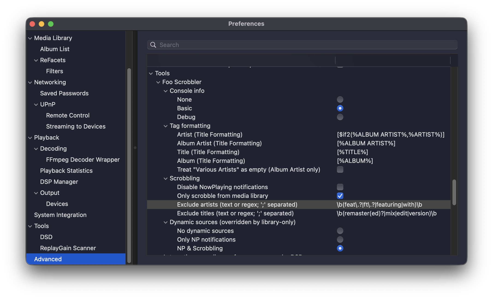

# Foo Scrobbler

**Native Last.fm scrobbling for foobar2000.**  
Runs inside foobar (no wrappers), follows strict playback qualification rules, supports “Now Playing”, and keeps a local queue when you’re offline. One-time authentication, then it stays quiet.

**License:** MIT License  
**Copyright:** © 2025–2026 Konstantinos Kyriakopoulos

## Choose your platform
Code and releases live in the platform repos below.

### macOS (Intel + Apple Silicon)
- **Repo:** [foo_scrobbler_mac](https://github.com/zfoxer/foo_scrobbler_mac)  
- **Release:** [1.0.6](https://github.com/zfoxer/foo_scrobbler_mac/releases/tag/v1.0.6)  
- **OS support:** macOS **11.5+** (Intel, ARM)

### Windows (x86, x64, arm64ec)
- **Repo:** [foo_scrobbler_win](https://github.com/zfoxer/foo_scrobbler_win)  
- **Release:** [1.0.6](https://github.com/zfoxer/foo_scrobbler_win/releases/tag/v1.0.6)  
- **OS support:** Windows **10** (x86, x64) and Windows **11** (x64, arm64ec)

## What it does
- **Now Playing** and **scrobbles** via the official **Last.fm Scrobbling 2.0 API**
- **Deterministic scrobble rules** (e.g., ≥ 50% played or ≥ 240 seconds)
- **Offline caching** with automatic queue flush when connectivity returns
- **Strict validation** to avoid malformed or duplicate submissions
- **Low overhead**, lean implementation, no compatibility layers, no 3rd-party deps

## Quick start (both platforms)
1. In foobar2000: **Preferences → Components**
2. Install the platform component (`.fb2k-component`)
3. Authenticate once with your Last.fm account via browser flow
4. Play music. Scrobbling happens automatically.

## Documentation
- Wiki (technical docs): [https://github.com/zfoxer/foo_scrobbler_mac/wiki](https://github.com/zfoxer/foo_scrobbler_mac/wiki)

## Licensing notes
This project’s **Foo Scrobbler plugin source code** is licensed under the **MIT License**.

The **foobar2000 SDK is proprietary** and is not covered by the MIT License. It remains the property of its original author (Peter Pawlowski / foobar2000).